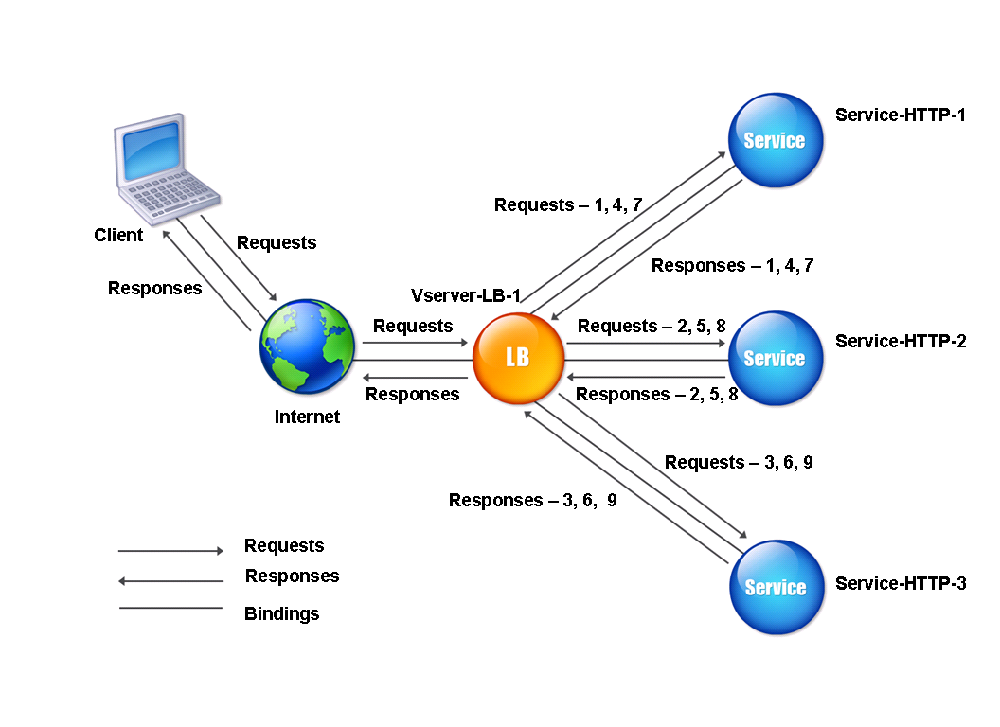

# Descrição do projeto
é um projeto que mostra html com um loadbalance com a estratégia round-robin, embora existam outras estratégias,
para o que foi passado de atividade esta é a que mais facilmente se encaixa com o que foi pedido e com o tipo de
serviço prestado pelo servidor.
outras estratégias não teriam o comportamento esperado 100% das vezes. a estratégia round-robin é boa para exibição
de html estático por dividir as requisições entre os servidores que foi configurado por dividir as requisições entre
todos os servidores. se existisse uma diferença de capacidade de processamento de requisições entre servidores, seria
melhor utilizar a Weighted Round-Robin que define pesos para cada máquina para definir de forma equivalente à capacidade
de processamento de cada uma. por exemplo, foi identificado que o servidor 1 dentre os 3 que a empresa aluga, tem a capacidade
de processar 20% a mais que os servidores 2 e 3, do qual ambos tem capacidade de processamento próxima com margem de erro baixa,
para o servidor 1 poderia se por peso 12 para ela enquanto as outras ficariam com peso 10, dessa forma 20% a mais das requisições
iriam para o servidor 1

esta configuração deve ser feita no arquivo nginx.conf
alterando o atual para:
```
events {}

http {
   upstream backend {
       server server1:80 weight=12;
       server server2:80 weight=10;
       server server3:80 weight=10;
   }


   server {
       listen 80;


       location / {
           proxy_pass http://backend;
       }
   }
}
```
como o meu caso foi todo o processo feito na mesma máquina, e no docker, os nomes server1, server2 e server3 são resolvidos automaticamente pelo DNS interno do Docker para os respectivos contêineres na rede criada pelo Docker Compose

A estratégia Weighted Round-Robin é útil para distribuir requisições de forma proporcional à capacidade de processamento de cada servidor. No entanto, no NGINX, os pesos são configurados manualmente e não se ajustam automaticamente com base no desempenho real dos servidores.

Existem outras formas de balanceamento, porém cada aplicação deve ser estudada para que seja definido corretamente a estratégia de balanceamento para ela.


# foi utilizado neste projeto:

- NGINX para hostear o arquivo html
- NGINX para loadbalance
- HTML para fazer o arquivo
- docker para criar as maquinas virtuais
- docker-compose para ler o arquivo docker-compose.yml e gerar as máquinas virtuais


# Arquitetura atual do projeto



# Como a capacidade poderia ser expandida no futuro


no caso deste projeto que é só exibição de html a possibilidade de expansão é só por mais máquinas, já se fosse algo que eu tenho que usar um banco de dados e fileserver aí já complica um pouco mais. se a estratégia fosse utilizar um banco de dados só entre todas as máquinas, e um backend em cada máquina nova, e um file server para responder a todos os backs então só crescer a quantidade de máquinas que rodam o backend é o suficiente embora pudessem se transformar em gargalos no futuro, caso o fileserve ou banco de dados for posto em cada uma das máquinas ou for definido mais de um servidor rodando cada um dos serviços, é importante por uma forma de igualar todos os file servers e bancos de dados durante o funcionamento via websocket durante o funcionamento normal de várias máquinas ou caso seja iniciada uma nova máquina algum script de cópia dos arquivos necessários junto com a conversa via websocket, também é importante que cada requisição seja mantido um protocolo de retorno apenas caso seja feito o processamento de alterações ou criações em mais de uma das máquinas para evitar que alguma alteração seja feita apenas em uma máquina, e ao fechar ou ela ter problemas, a alteração não ser perdida por ter ocorrido em mais de um servidor. A conexão via WebSocket deve ser configurada corretamente, preferencialmente em uma rede privada ou utilizando TLS (wss://) para proteger o transporte de dados. Isso evita ataques como Man-in-the-Middle (MITM) ou packet sniffing. Além disso, é importante configurar autenticação e validação de certificados para garantir a segurança das conexões.